# AI Auditor Design Document
## SaaS Compliance Platform Enhancement

### Executive Summary
This document outlines the design for an AI Auditor feature to be integrated into the existing Bubble-based SaaS compliance platform. The AI Auditor will provide automated evidence review, expert chat assistance, and knowledge base integration using AWS Bedrock.

### Core Capabilities

#### 1. Automated Evidence Auditing
- **Functionality**: AI reviews all uploaded evidence against compliance controls
- **Output**: Detailed feedback and recommendations for each control
- **Trigger**: Customer-initiated audit runs after evidence upload completion

#### 2. Expert Chat Interface
- **Functionality**: Interactive AI assistant for evidence owners
- **Purpose**: Provide auditor expertise and guidance during evidence preparation
- **Context**: Leverages control-specific knowledge base

#### 3. Knowledge Base Integration
- **Scope**: Comprehensive knowledge base for each compliance regime
- **Content**: Control requirements, best practices, common issues
- **Integration**: Powers both audit feedback and chat responses

### Architecture Overview

#### Option 1: Evidence Storage in Bubble (Recommended Approach)

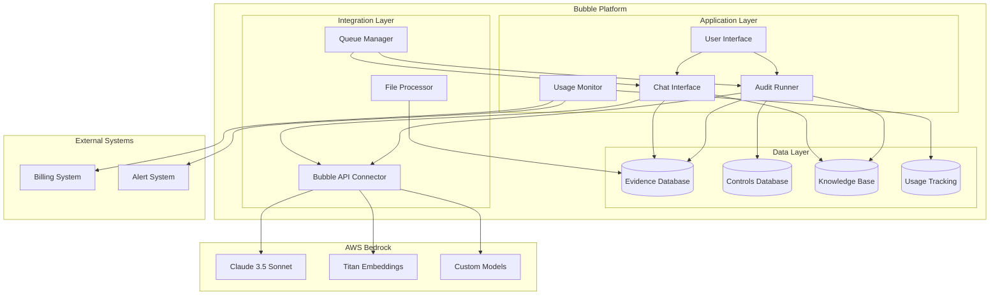

### AI Processing Architecture Decision

#### Option A: Vector Database Approach (Recommended)
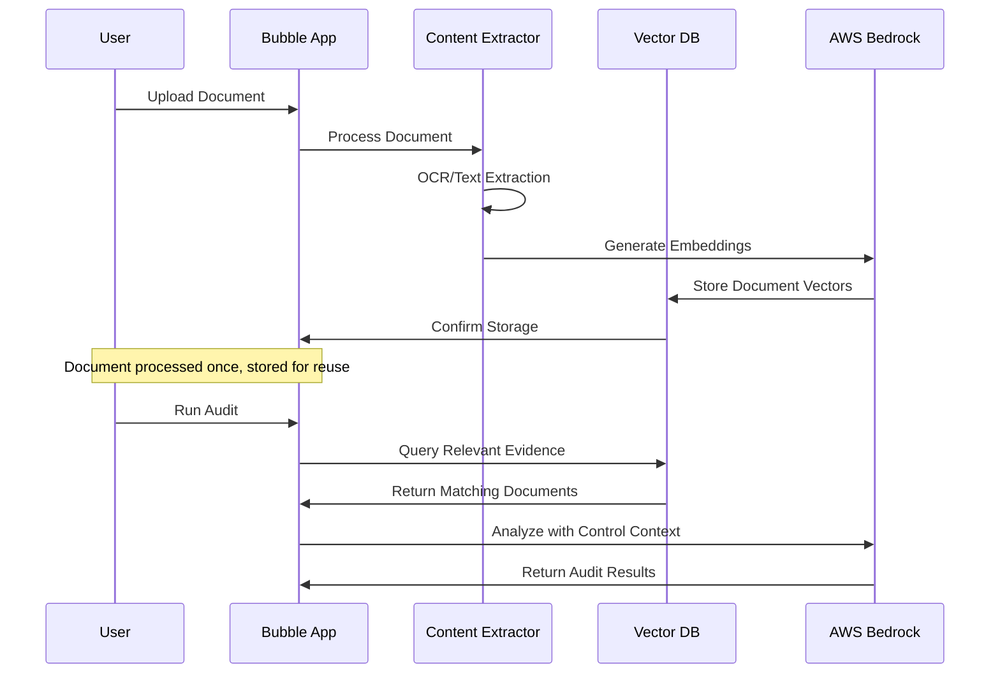

#### Option B: Direct API Approach
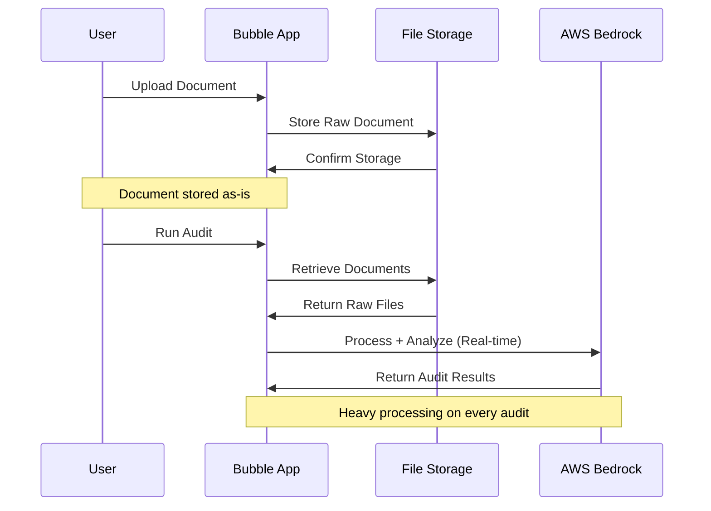

#### Comparison Analysis

| Aspect | Vector DB Approach | Direct API Approach |
|--------|-------------------|-------------------|
| **Initial Processing** | Heavy (once per document) | Light (store only) |
| **Audit Performance** | Fast (pre-processed) | Slow (process each time) |
| **Cost per Audit** | Low (cached embeddings) | High (full reprocessing) |
| **Storage Requirements** | Higher (vectors + raw) | Lower (raw files only) |
| **Scalability** | Excellent | Poor with volume |
| **Multi-language Support** | Better (embedding models) | Depends on multimodal AI |
| **Search Capabilities** | Semantic search enabled | Limited to full document |
| **Complexity** | Higher initial setup | Simpler architecture |

### Technical Implementation

#### Recommended Architecture: Hybrid Vector + Direct Processing

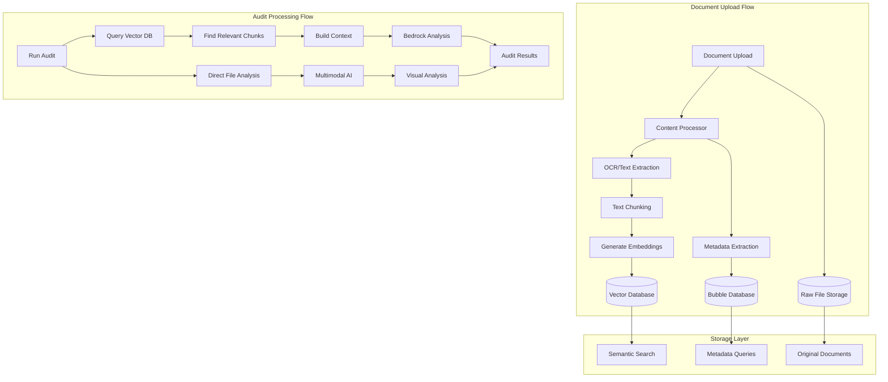

#### Processing Strategy by Document Type

**Text Documents (PDFs, Word, etc.)**
- Extract text → Generate embeddings → Store in vector DB
- Enable semantic search and context retrieval
- Fast audit processing using pre-computed vectors

**Visual Documents (Images, Charts, Diagrams)**
- Store original files → Direct multimodal AI processing
- Use Claude 3.5 Sonnet or GPT-4V for visual analysis
- Process on-demand during audits

**Structured Data (Spreadsheets, JSON)**
- Extract structured data → Store in Bubble database
- Generate embeddings for text fields
- Direct processing for calculations/validations

#### Implementation Details

**Vector Database Options:**
1. **AWS OpenSearch** (Recommended for AWS ecosystem)
2. **Pinecone** (Managed, easy to use)
3. **Chroma** (Open source, self-hosted)
4. **Bubble Plugin** (Vector search plugins available)

**Processing Pipeline:**
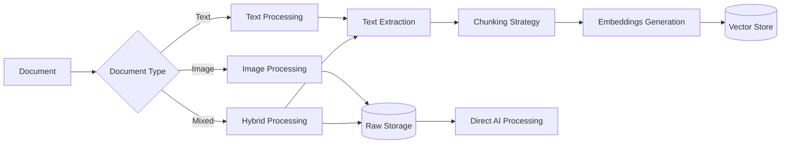

**Chunking Strategy:**
- **Semantic Chunking**: Split by paragraphs, sections
- **Overlap**: 20% overlap between chunks for context
- **Size**: 500-1000 tokens per chunk
- **Metadata**: Include document source, page numbers, control mappings

#### Cost Analysis: Vector DB vs Direct API

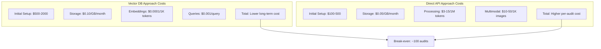

#### Performance Comparison

| Metric | Vector DB | Direct API |
|--------|-----------|------------|
| **Document Upload** | 30-60 seconds | 1-5 seconds |
| **Audit Runtime** | 5-15 seconds | 30-120 seconds |
| **Concurrent Audits** | High (cached data) | Limited (processing bottleneck) |
| **Search Accuracy** | Semantic matching | Full document context |
| **Memory Usage** | Low (vector queries) | High (full document processing) |

#### Implementation Decision: Direct API Approach

**Current Strategy: Direct API for MVP**
- Faster initial development (2-4 weeks vs 8-12 weeks)
- Lower upfront complexity and costs
- Perfect for <50 customers
- Validate user workflows before scaling

**Future Migration Path:**
- Migrate to Vector DB when >50 active customers
- Add vector processing for text documents
- Keep direct processing for images/complex visuals

### Direct API Implementation Details

#### Data Storage Strategy
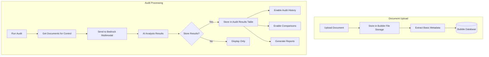

#### Recommended Data Model for Direct API

**Documents Table:**
- document_id (Primary Key)
- file_name
- file_type
- file_size
- upload_date
- control_mappings (List of control IDs)
- customer_id
- file_url (Bubble file reference)

**Audit Results Table (Recommended to Store):**
- audit_id (Primary Key)
- control_id
- document_ids (List of analyzed documents)
- ai_findings (JSON with structured results)
- recommendations (Text)
- compliance_status (Pass/Fail/Partial)
- confidence_score (0-100)
- audit_date
- customer_id
- auditor_version (Track AI model versions)

**Benefits of Storing Analysis Results:**
✅ Audit trail and compliance history
✅ Progress tracking over time
✅ Faster re-display of previous results
✅ Comparative analysis between audits
✅ Reporting and analytics capabilities
✅ Reduced API costs for repeat views

#### Processing Flow for Direct API
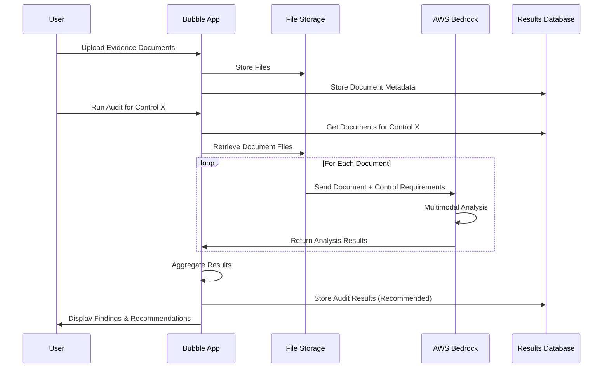

#### Code Implementation Approach

**Bubble Workflow for Vector DB:**
```javascript
// Pseudo-code for Bubble backend workflow
When Document is uploaded:
  1. Extract text content
  2. Generate embeddings via Bedrock API
  3. Store vectors in external vector DB
  4. Store metadata in Bubble database
  
When Audit is triggered:
  1. Query vector DB for relevant content
  2. Retrieve top-k similar chunks
  3. Send context + control requirements to Bedrock
  4. Process AI response and store results
```

**Bubble Workflow for Direct API:**
```javascript
// Pseudo-code for direct processing
When Document is uploaded:
  1. Store file in Bubble file storage
  2. Extract basic metadata only
  
When Audit is triggered:
  1. Retrieve all documents for control
  2. Send files directly to Bedrock multimodal
  3. Process response and store results
```

#### Knowledge Base Structure
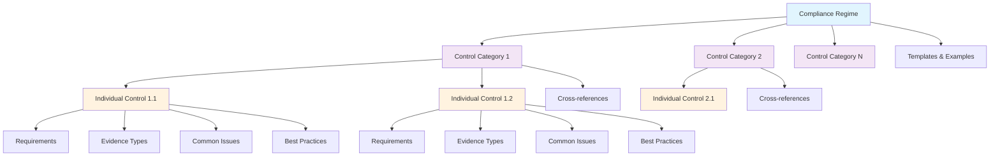

### Pros and Cons Analysis

#### Pros: Evidence in Bubble
✅ **Unified Data Management**: Single source of truth for all compliance data
✅ **Simplified Architecture**: Reduced complexity with fewer external dependencies
✅ **Native Integration**: Seamless workflow within existing Bubble app
✅ **Cost Efficiency**: No additional storage infrastructure costs
✅ **Security**: Leverages Bubble's existing security model
✅ **User Experience**: Consistent interface and permissions model
✅ **Backup/Recovery**: Included in Bubble's data protection
✅ **Compliance**: Easier to maintain data residency requirements

#### Cons: Evidence in Bubble
❌ **Storage Limitations**: Bubble file storage limits may constrain large evidence files
❌ **Performance**: Large file processing may impact app performance
❌ **Scalability**: Potential bottlenecks with high-volume evidence uploads
❌ **File Processing**: Limited native capabilities for complex document analysis
❌ **Vendor Lock-in**: Increased dependency on Bubble platform
❌ **Cost Scaling**: Bubble storage costs may become significant at scale

### Cost Chargeback Options

#### Cost Model Overview
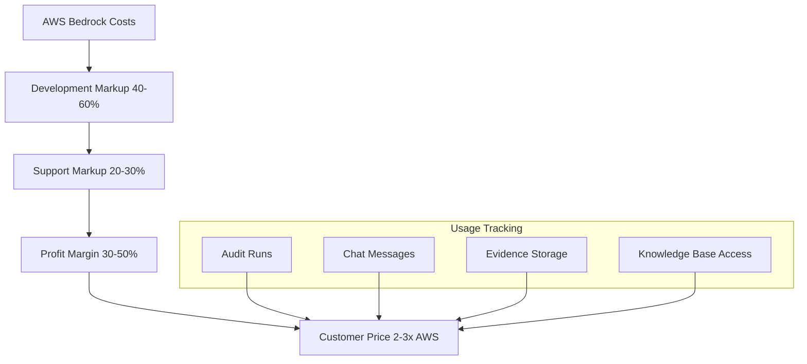

#### 1. Usage-Based Pricing Model
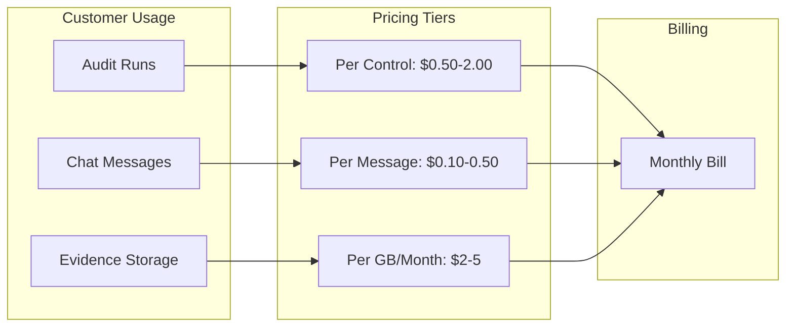

#### 2. Tiered Subscription Model
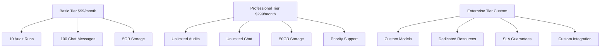

#### 3. Credit-Based System
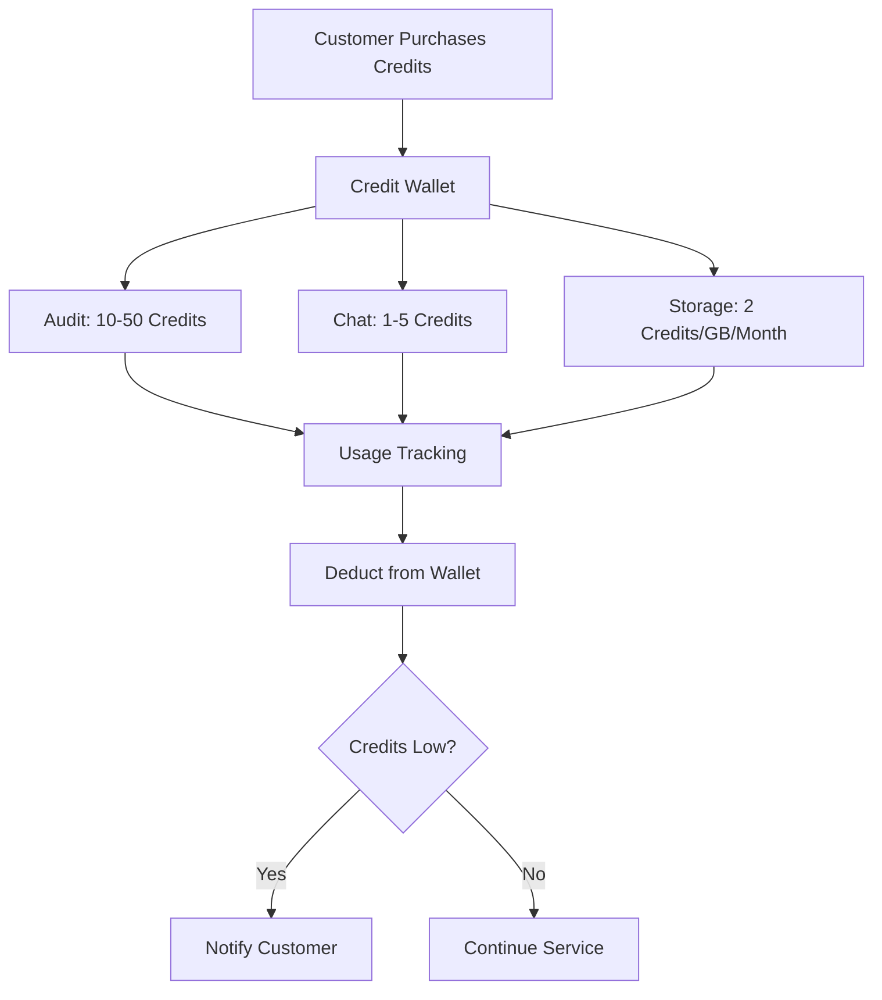

#### 4. Hybrid Model (Recommended)
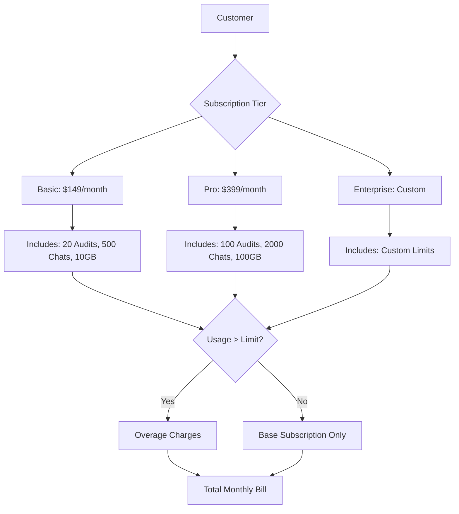

### Cost Calculation Framework

#### AWS Bedrock Costs (Estimated)
- **Claude 3.5 Sonnet**: ~$3 per 1M input tokens, ~$15 per 1M output tokens
- **Titan Embeddings**: ~$0.0001 per 1K tokens
- **Knowledge Base**: ~$0.10 per GB per month

#### Markup Strategy
- **Development/Maintenance**: 40-60% markup
- **Support/Infrastructure**: 20-30% markup
- **Profit Margin**: 30-50% markup
- **Total Customer Price**: 2-3x AWS costs

#### Example Pricing Structure
```
Audit Run Pricing:
- Small Control Set (1-10 controls): $5-15 per run
- Medium Control Set (11-50 controls): $20-50 per run
- Large Control Set (50+ controls): $60-150 per run

Chat Interface:
- Per Message: $0.10-0.50
- Per Session (up to 50 messages): $5-15
- Monthly Unlimited: $50-200

Storage:
- Evidence Storage: $2-5 per GB per month
- Knowledge Base Access: $10-30 per regime per month
```

### Implementation Phases

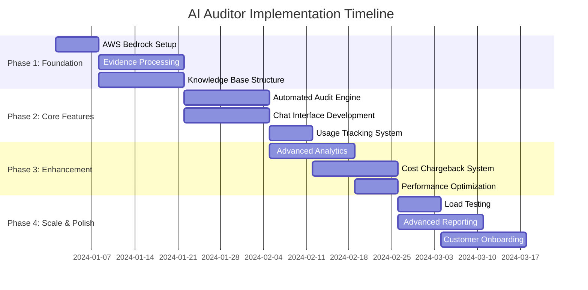

#### Phase Details Flow
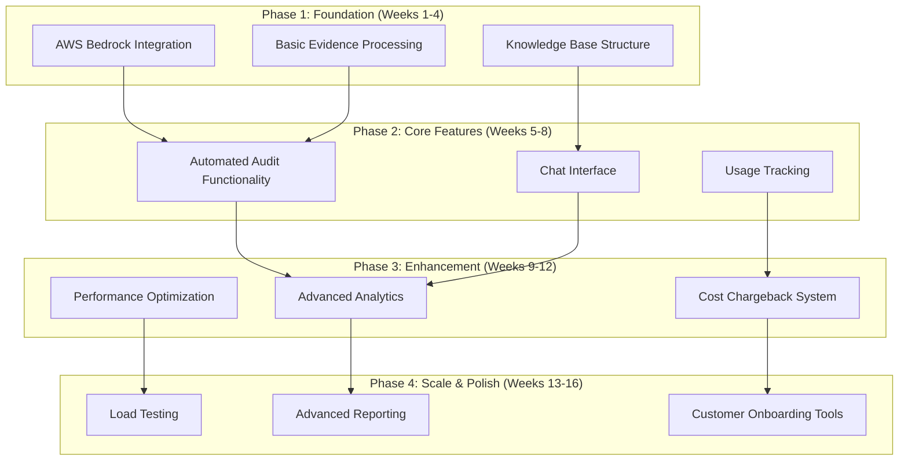

### Risk Mitigation

#### Technical Risks
- **Bubble Performance**: Implement file processing queues
- **AI Accuracy**: Continuous model training and validation
- **Data Security**: Encryption at rest and in transit

#### Business Risks
- **Cost Overruns**: Implement usage caps and alerts
- **Customer Adoption**: Phased rollout with feedback loops
- **Compliance**: Regular security and compliance audits

### Success Metrics

#### KPI Dashboard Overview
```mermaid
graph TD
    subgraph "Technical KPIs"
        ACC[Audit Accuracy >90%]
        RT[Response Time <3s]
        UP[Uptime >99.5%]
        PROC[Processing Speed]
    end
    
    subgraph "Business KPIs"
        ADOPT[Customer Adoption Rate]
        REV[Revenue per Customer]
        COST[Cost Recovery Ratio]
        SAT[Customer Satisfaction]
    end
    
    subgraph "Usage Metrics"
        AU[Audit Runs per Month]
        CM[Chat Messages per User]
        ST[Storage Growth Rate]
        RET[Customer Retention]
    end
    
    ACC --> DASH[KPI Dashboard]
    RT --> DASH
    UP --> DASH
    ADOPT --> DASH
    REV --> DASH
    COST --> DASH
    AU --> DASH
    CM --> DASH
    ST --> DASH
```

#### Success Measurement Flow
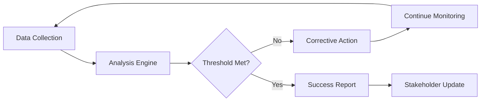

### Next Steps

1. **Stakeholder Review**: Present design to key stakeholders
2. **Technical Validation**: Prototype core AI integration
3. **Cost Modeling**: Detailed financial projections
4. **Customer Research**: Validate pricing with target customers
5. **Development Planning**: Detailed sprint planning and resource allocation

---

*This document serves as the foundation for implementing the AI Auditor feature. Regular updates will be made as requirements evolve and implementation progresses.*

#### Chat Interface Implementation with Vector Context

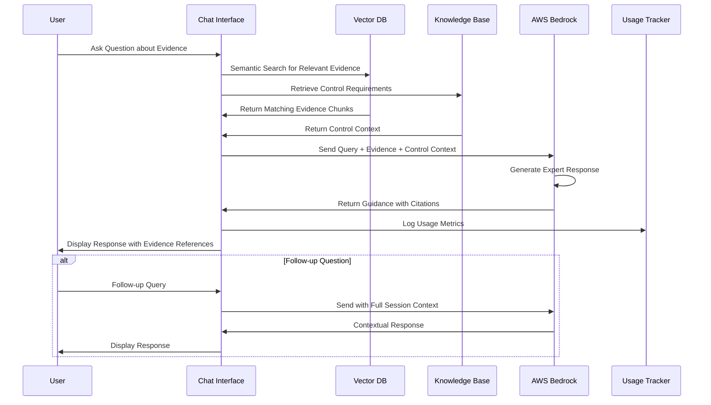

#### Bubble Implementation for Direct API

**Workflow Setup in Bubble:**

1. **Document Upload Workflow:**
```javascript
// Bubble Backend Workflow
When File Uploader's value is changed:
  Step 1: Create new Document record
    - Set file_name = File Uploader's file name
    - Set file_type = File Uploader's file type  
    - Set file_url = File Uploader's value
    - Set customer_id = Current User's Customer
    - Set upload_date = Current date/time
  
  Step 2: Extract basic metadata (optional)
    - Set file_size = File Uploader's file size
    - Set control_mappings = (user selected controls)
```

2. **Audit Processing Workflow:**
```javascript
// Bubble Backend Workflow  
When "Run Audit" button is clicked:
  Step 1: Get documents for control
    - Search Documents where control_mappings contains Current Control
  
  Step 2: For each document, call Bedrock API
    - API Connector: AWS Bedrock
    - Send: Document file + Control requirements + Prompt template
    - Receive: AI analysis results
  
  Step 3: Store results (Recommended)
    - Create Audit Result record
    - Set ai_findings = API response
    - Set compliance_status = Parsed from AI response
    - Set recommendations = Extracted recommendations
  
  Step 4: Display to user
    - Show aggregated results
    - Highlight gaps and recommendations
```

**API Connector Configuration:**
- **Endpoint**: AWS Bedrock Claude 3.5 Sonnet
- **Authentication**: AWS IAM credentials
- **Request Format**: Multimodal (text + file)
- **Response Parsing**: Extract structured findings

**Prompt Template for Bedrock:**
```
You are an expert compliance auditor. Analyze the provided evidence document against the following control requirement:

CONTROL: [Control ID and Description]
REQUIREMENTS: [Specific requirements to check]

DOCUMENT: [Attached file]

Provide your analysis in this JSON format:
{
  "compliance_status": "Pass|Fail|Partial",
  "confidence_score": 85,
  "findings": [
    {
      "requirement": "Specific requirement",
      "status": "Met|Not Met|Partially Met", 
      "evidence_found": "Description of evidence",
      "gaps": "What's missing if any"
    }
  ],
  "recommendations": [
    "Specific actionable recommendation 1",
    "Specific actionable recommendation 2"
  ],
  "summary": "Overall assessment summary"
}
```

### AWS Technical Architecture

#### AWS Infrastructure Overview
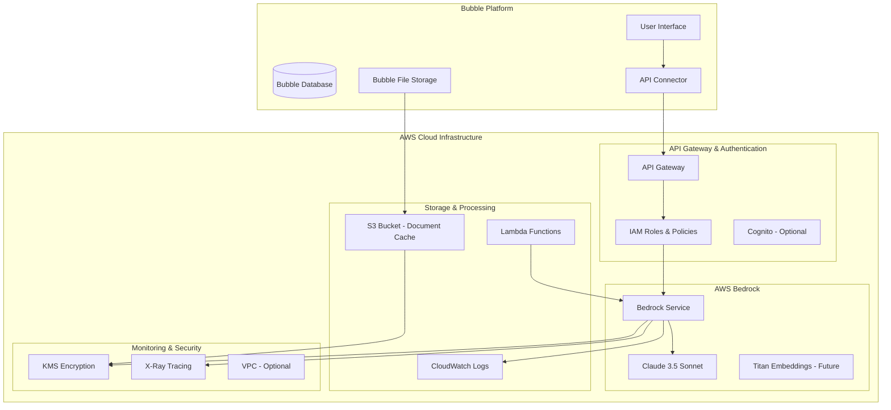

#### AWS Bedrock Integration Architecture
```mermaid
graph TD
    subgraph "Bubble Application"
        UPLOAD[Document Upload]
        TRIGGER[Audit Trigger]
        DISPLAY[Results Display]
    end
    
    subgraph "AWS API Gateway"
        GATEWAY[API Gateway Endpoint]
        AUTH[Request Authentication]
        THROTTLE[Rate Limiting]
    end
    
    subgraph "AWS Bedrock"
        BEDROCK_API[Bedrock API]
        MODEL_ROUTER[Model Router]
        CLAUDE_35[Claude 3.5 Sonnet]
        GUARDRAILS[Bedrock Guardrails]
    end
    
    subgraph "AWS Supporting Services"
        S3_TEMP[S3 - Temp Document Storage]
        LAMBDA_PROC[Lambda - Document Processor]
        CW_LOGS[CloudWatch Logs]
        CW_METRICS[CloudWatch Metrics]
    end
    
    UPLOAD --> GATEWAY
    TRIGGER --> GATEWAY
    GATEWAY --> AUTH
    AUTH --> THROTTLE
    THROTTLE --> BEDROCK_API
    
    BEDROCK_API --> MODEL_ROUTER
    MODEL_ROUTER --> CLAUDE_35
    CLAUDE_35 --> GUARDRAILS
    
    GATEWAY --> S3_TEMP
    S3_TEMP --> LAMBDA_PROC
    LAMBDA_PROC --> BEDROCK_API
    
    BEDROCK_API --> CW_LOGS
    BEDROCK_API --> CW_METRICS
    
    GUARDRAILS --> DISPLAY
```

#### Data Flow Architecture
```mermaid
sequenceDiagram
    participant Bubble as Bubble App
    participant S3 as AWS S3
    participant Gateway as API Gateway
    participant Bedrock as AWS Bedrock
    participant Claude as Claude 3.5
    participant CW as CloudWatch
    
    Note over Bubble,CW: Document Upload & Processing Flow
    
    Bubble->>S3: Upload Document (Optional Caching)
    Bubble->>Gateway: POST /analyze-document
    Gateway->>Gateway: Authenticate Request
    Gateway->>Bedrock: Forward Request
    
    Bedrock->>Claude: Send Document + Prompt
    Claude->>Claude: Multimodal Analysis
    Claude->>Bedrock: Return Structured Results
    
    Bedrock->>CW: Log Request Metrics
    Bedrock->>Gateway: Return Analysis Results
    Gateway->>Bubble: JSON Response
    
    Bubble->>Bubble: Store Results in Database
    Bubble->>Bubble: Display to User
```

#### AWS Security Architecture
```mermaid
graph TB
    subgraph "Security Layers"
        subgraph "Network Security"
            VPC[VPC - Optional]
            SG[Security Groups]
            NACL[Network ACLs]
        end
        
        subgraph "Identity & Access"
            IAM_ROLE[IAM Service Role]
            IAM_POLICY[IAM Policies]
            API_KEY[API Keys]
        end
        
        subgraph "Data Protection"
            KMS_KEY[KMS Customer Keys]
            ENCRYPT_TRANSIT[TLS 1.2+ Encryption]
            ENCRYPT_REST[S3 Encryption at Rest]
        end
        
        subgraph "Monitoring & Compliance"
            CLOUDTRAIL[CloudTrail Audit Logs]
            CONFIG[AWS Config Rules]
            GUARD_DUTY[GuardDuty - Optional]
        end
    end
    
    subgraph "Bubble Integration"
        BUBBLE_APP[Bubble Application]
        API_CONNECTOR[Bubble API Connector]
    end
    
    BUBBLE_APP --> API_CONNECTOR
    API_CONNECTOR --> API_KEY
    API_KEY --> IAM_ROLE
    IAM_ROLE --> IAM_POLICY
    
    IAM_POLICY --> VPC
    VPC --> SG
    
    API_CONNECTOR --> ENCRYPT_TRANSIT
    ENCRYPT_TRANSIT --> KMS_KEY
    KMS_KEY --> ENCRYPT_REST
    
    IAM_ROLE --> CLOUDTRAIL
    CLOUDTRAIL --> CONFIG
```

#### Option A: Store Analysis Results (Recommended)

**What to Store:**
```mermaid
graph TD
    AI[AI Analysis] --> STRUCT[Structured Results]
    STRUCT --> FINDINGS[Individual Findings per Requirement]
    STRUCT --> RECS[Actionable Recommendations] 
    STRUCT --> STATUS[Compliance Status]
    STRUCT --> CONF[Confidence Scores]
    STRUCT --> SUMMARY[Executive Summary]
    
    FINDINGS --> DB[(Audit Results Table)]
    RECS --> DB
    STATUS --> DB
    CONF --> DB
    SUMMARY --> DB
    
    DB --> HISTORY[Audit History]
    DB --> COMPARE[Progress Tracking]
    DB --> REPORTS[Compliance Reports]
    DB --> ANALYTICS[Trend Analysis]
```

**Benefits:**
✅ **Audit Trail**: Complete history of all assessments
✅ **Progress Tracking**: See improvements over time
✅ **Cost Efficiency**: Don't re-analyze for repeat views
✅ **Reporting**: Generate compliance reports instantly
✅ **Analytics**: Track trends and patterns
✅ **User Experience**: Instant access to previous results

**Storage Requirements:**
- ~1-5KB per document analysis
- ~10-50KB per complete control audit
- Minimal storage cost impact

#### Option B: Real-time Only (Not Recommended)

**Process:**
- Analyze documents on-demand
- Display results immediately
- Don't store analysis results

**Drawbacks:**
❌ **Cost**: Re-analyze every time (expensive)
❌ **Speed**: Slow user experience
❌ **No History**: Can't track progress
❌ **No Reporting**: Limited compliance reporting

### Recommended Data Structure for Stored Results

```json
{
  "audit_id": "audit_123",
  "control_id": "SOC2_CC6.1", 
  "control_name": "Logical Access Controls",
  "audit_date": "2024-01-15T10:30:00Z",
  "overall_status": "Partial",
  "overall_confidence": 78,
  "documents_analyzed": [
    {
      "document_id": "doc_456",
      "document_name": "Access Control Policy.pdf",
      "analysis": {
        "status": "Pass",
        "confidence": 85,
        "findings": [
          {
            "requirement": "Written access control policy exists",
            "status": "Met",
            "evidence": "Policy document dated 2023-12-01 with proper approval signatures",
            "page_references": [1, 2]
          }
        ]
      }
    }
  ],
  "aggregated_findings": [
    {
      "requirement": "Access control policy documented",
      "status": "Met",
      "supporting_documents": ["doc_456"]
    },
    {
      "requirement": "Regular access reviews conducted", 
      "status": "Not Met",
      "gap": "No evidence of quarterly access reviews"
    }
  ],
  "recommendations": [
    "Implement quarterly access review process",
    "Document access review procedures"
  ],
  "next_steps": [
    "Upload quarterly access review reports",
    "Provide access review procedure documentation"
  ]
}
```

### Implementation Priority for Direct API Approach

**Phase 1 (Weeks 1-2): Basic Processing**
- Document upload and storage
- Direct API calls to Bedrock
- Display results in real-time

**Phase 2 (Weeks 3-4): Store Results** 
- Create audit results data model
- Store AI analysis for history
- Basic reporting capabilities

**Phase 3 (Weeks 5-6): Enhanced Features**
- Progress tracking over time
- Comparative analysis
- Advanced reporting

**Recommendation: Implement result storage from Phase 1** - it's minimal additional work but provides significant value for users and reduces long-term costs.
#### AWS Cost Optimization Architecture
```mermaid
graph TD
    subgraph "Cost Management Strategy"
        subgraph "Request Optimization"
            BATCH[Batch Processing]
            CACHE[Response Caching]
            COMPRESS[Request Compression]
        end
        
        subgraph "Resource Management"
            LAMBDA_SIZING[Right-sized Lambda]
            S3_LIFECYCLE[S3 Lifecycle Policies]
            CW_RETENTION[Log Retention Policies]
        end
        
        subgraph "Monitoring & Alerts"
            COST_EXPLORER[Cost Explorer]
            BUDGETS[AWS Budgets]
            BILLING_ALERTS[Billing Alerts]
        end
    end
    
    BATCH --> LAMBDA_SIZING
    CACHE --> S3_LIFECYCLE
    COMPRESS --> CW_RETENTION
    
    LAMBDA_SIZING --> COST_EXPLORER
    S3_LIFECYCLE --> BUDGETS
    CW_RETENTION --> BILLING_ALERTS
```

### AWS Service Configuration Details

#### 1. AWS Bedrock Configuration
```yaml
# Bedrock Model Configuration
Model: anthropic.claude-3-5-sonnet-20241022-v2:0
Region: us-east-1 (or us-west-2 for lower latency)
Max Tokens: 4096
Temperature: 0.1 (for consistent analysis)
Top P: 0.9

# Request Limits
Max Request Size: 20MB (for document uploads)
Timeout: 300 seconds
Retry Policy: Exponential backoff (3 retries)
```

#### 2. API Gateway Configuration
```yaml
# API Gateway Setup
Type: REST API
Authentication: IAM
Throttling: 
  - Burst Limit: 100 requests
  - Rate Limit: 50 requests/second
CORS: Enabled for Bubble domain
Request Validation: Enabled
Response Caching: 5 minutes (for identical requests)

# Endpoints
POST /analyze-document
POST /chat-query
GET /health-check
```

#### 3. IAM Policies
```json
{
  "Version": "2012-10-17",
  "Statement": [
    {
      "Effect": "Allow",
      "Action": [
        "bedrock:InvokeModel",
        "bedrock:InvokeModelWithResponseStream"
      ],
      "Resource": [
        "arn:aws:bedrock:*::foundation-model/anthropic.claude-3-5-sonnet-*"
      ]
    },
    {
      "Effect": "Allow", 
      "Action": [
        "s3:GetObject",
        "s3:PutObject"
      ],
      "Resource": [
        "arn:aws:s3:::your-compliance-docs-bucket/*"
      ]
    },
    {
      "Effect": "Allow",
      "Action": [
        "logs:CreateLogGroup",
        "logs:CreateLogStream", 
        "logs:PutLogEvents"
      ],
      "Resource": "*"
    }
  ]
}
```

#### 4. S3 Bucket Configuration
```yaml
# S3 Bucket for Document Caching (Optional)
Bucket Name: compliance-ai-documents-[environment]
Region: Same as Bedrock
Encryption: AES-256 (S3 Managed) or KMS
Versioning: Disabled (temporary storage)
Lifecycle Policy:
  - Delete objects after 7 days
  - Transition to IA after 1 day (if keeping longer)

# Access Policy
Public Access: Blocked
Access: IAM role only
CORS: Configured for Bubble domain
```

#### 5. CloudWatch Configuration
```yaml
# Logging Configuration
Log Groups:
  - /aws/apigateway/compliance-ai-api
  - /aws/bedrock/model-invocations
  - /aws/lambda/document-processor

# Metrics & Alarms
Custom Metrics:
  - API Response Time
  - Bedrock Token Usage
  - Error Rates
  - Cost per Request

Alarms:
  - High Error Rate (>5%)
  - High Latency (>30 seconds)
  - Daily Cost Threshold ($100)
```

### AWS Deployment Architecture Options

#### Option 1: Simple Direct Integration (Recommended for MVP)
```mermaid
graph LR
    BUBBLE[Bubble App] --> APIGW[API Gateway]
    APIGW --> BEDROCK[AWS Bedrock]
    BEDROCK --> CLAUDE[Claude 3.5]
    
    style BUBBLE fill:#e1f5fe
    style BEDROCK fill:#fff3e0
```

#### Option 2: Enhanced with Caching & Processing
```mermaid
graph LR
    BUBBLE[Bubble App] --> APIGW[API Gateway]
    APIGW --> LAMBDA[Lambda Processor]
    LAMBDA --> S3[S3 Cache]
    LAMBDA --> BEDROCK[AWS Bedrock]
    BEDROCK --> CLAUDE[Claude 3.5]
    
    style BUBBLE fill:#e1f5fe
    style LAMBDA fill:#f3e5f5
    style BEDROCK fill:#fff3e0
```

#### Option 3: Enterprise with Full Monitoring
```mermaid
graph TB
    BUBBLE[Bubble App] --> APIGW[API Gateway]
    APIGW --> LAMBDA[Lambda Processor]
    LAMBDA --> S3[S3 Cache]
    LAMBDA --> BEDROCK[AWS Bedrock]
    BEDROCK --> CLAUDE[Claude 3.5]
    
    LAMBDA --> CW[CloudWatch]
    APIGW --> XRAY[X-Ray Tracing]
    BEDROCK --> COST[Cost Explorer]
    
    style BUBBLE fill:#e1f5fe
    style LAMBDA fill:#f3e5f5
    style BEDROCK fill:#fff3e0
    style CW fill:#e8f5e8
```

### Implementation Phases for AWS Integration

#### Phase 1: Basic Bedrock Integration (Week 1-2)
- Set up AWS Bedrock access
- Configure API Gateway
- Create basic IAM roles
- Test document analysis

#### Phase 2: Production Hardening (Week 3-4)
- Add error handling and retries
- Implement request validation
- Set up CloudWatch monitoring
- Configure security policies

#### Phase 3: Optimization & Scaling (Week 5-6)
- Add response caching
- Implement cost monitoring
- Set up automated alerts
- Performance optimization

### Key Decision: Should You Store AI Analysis Results?