# AI Auditor Design Document
## SaaS Compliance Platform Enhancement

### Executive Summary
This document outlines the design for an AI Auditor feature to be integrated into the existing Bubble-based SaaS compliance platform. The AI Auditor will provide automated evidence review, expert chat assistance, and knowledge base integration using AWS Bedrock.

### Core Capabilities

#### 1. Automated Evidence Auditing
- **Functionality**: AI reviews all uploaded evidence against compliance controls
- **Output**: Detailed feedback and recommendations for each control
- **Trigger**: Customer-initiated audit runs after evidence upload completion

#### 2. Expert Chat Interface
- **Functionality**: Interactive AI assistant for evidence owners
- **Purpose**: Provide auditor expertise and guidance during evidence preparation
- **Context**: Leverages control-specific knowledge base

#### 3. Knowledge Base Integration
- **Scope**: Comprehensive knowledge base for each compliance regime
- **Content**: Control requirements, best practices, common issues
- **Integration**: Powers both audit feedback and chat responses

### Architecture Overview

#### Option 1: Evidence Storage in Bubble (Recommended Approach)

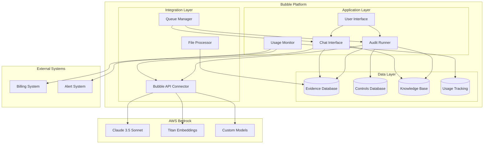

### Technical Implementation

#### Evidence Processing Flow
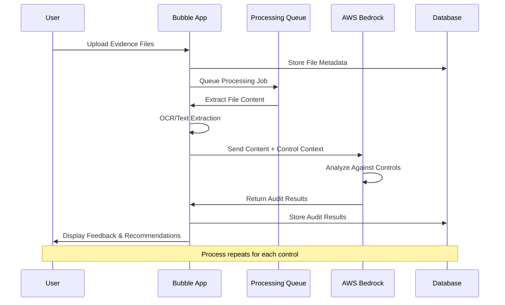

#### Chat Interface Implementation
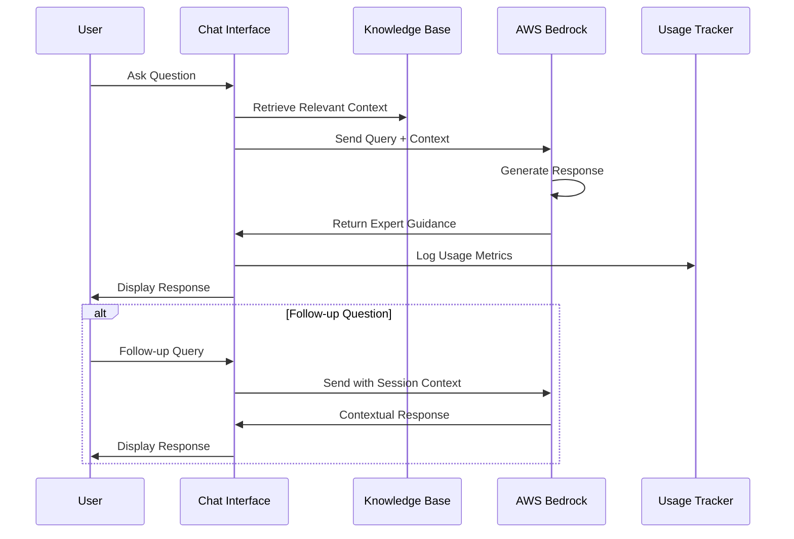

#### Knowledge Base Structure
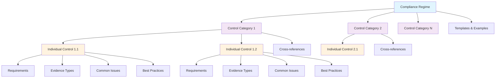

### Pros and Cons Analysis

#### Pros: Evidence in Bubble
✅ **Unified Data Management**: Single source of truth for all compliance data
✅ **Simplified Architecture**: Reduced complexity with fewer external dependencies
✅ **Native Integration**: Seamless workflow within existing Bubble app
✅ **Cost Efficiency**: No additional storage infrastructure costs
✅ **Security**: Leverages Bubble's existing security model
✅ **User Experience**: Consistent interface and permissions model
✅ **Backup/Recovery**: Included in Bubble's data protection
✅ **Compliance**: Easier to maintain data residency requirements

#### Cons: Evidence in Bubble
❌ **Storage Limitations**: Bubble file storage limits may constrain large evidence files
❌ **Performance**: Large file processing may impact app performance
❌ **Scalability**: Potential bottlenecks with high-volume evidence uploads
❌ **File Processing**: Limited native capabilities for complex document analysis
❌ **Vendor Lock-in**: Increased dependency on Bubble platform
❌ **Cost Scaling**: Bubble storage costs may become significant at scale

### Cost Chargeback Options

#### Cost Model Overview
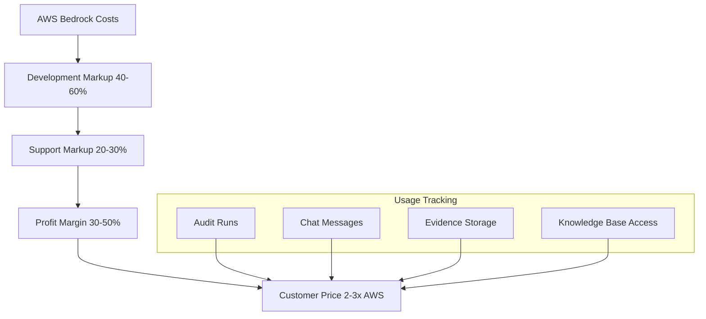

#### 1. Usage-Based Pricing Model
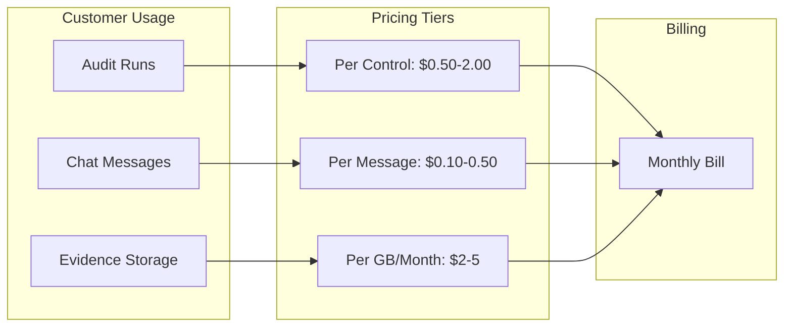

#### 2. Tiered Subscription Model
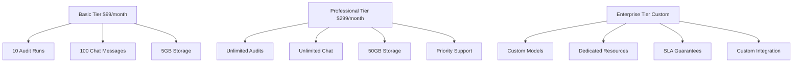

#### 3. Credit-Based System
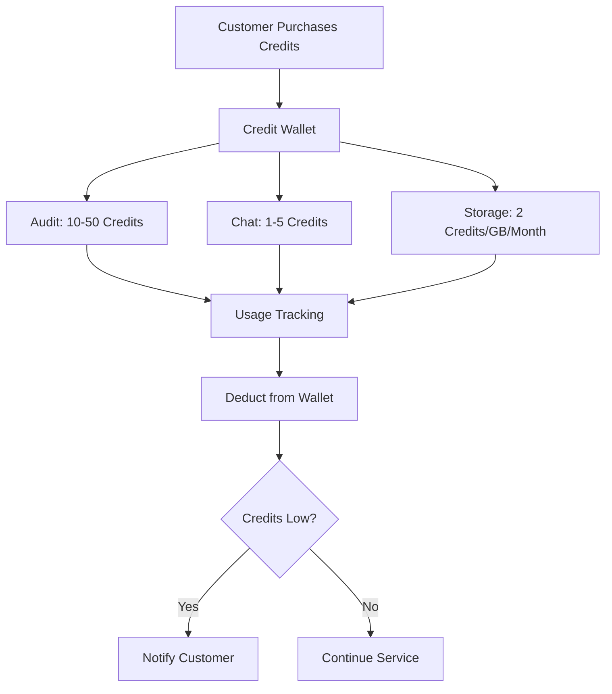

#### 4. Hybrid Model (Recommended)
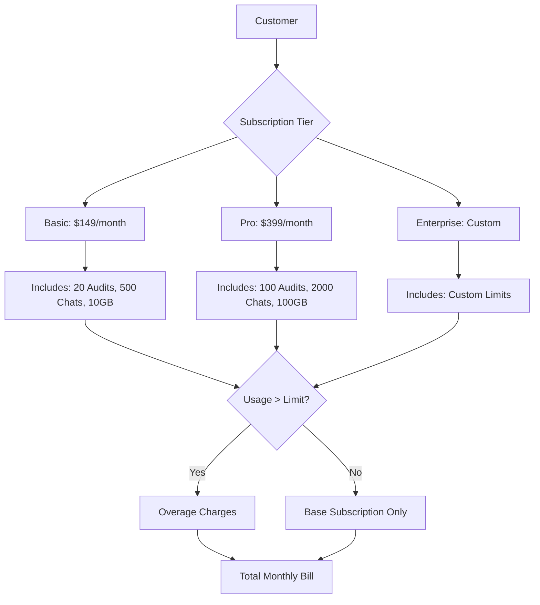

### Cost Calculation Framework

#### AWS Bedrock Costs (Estimated)
- **Claude 3.5 Sonnet**: ~$3 per 1M input tokens, ~$15 per 1M output tokens
- **Titan Embeddings**: ~$0.0001 per 1K tokens
- **Knowledge Base**: ~$0.10 per GB per month

#### Markup Strategy
- **Development/Maintenance**: 40-60% markup
- **Support/Infrastructure**: 20-30% markup
- **Profit Margin**: 30-50% markup
- **Total Customer Price**: 2-3x AWS costs

#### Example Pricing Structure
```
Audit Run Pricing:
- Small Control Set (1-10 controls): $5-15 per run
- Medium Control Set (11-50 controls): $20-50 per run
- Large Control Set (50+ controls): $60-150 per run

Chat Interface:
- Per Message: $0.10-0.50
- Per Session (up to 50 messages): $5-15
- Monthly Unlimited: $50-200

Storage:
- Evidence Storage: $2-5 per GB per month
- Knowledge Base Access: $10-30 per regime per month
```

### Implementation Phases

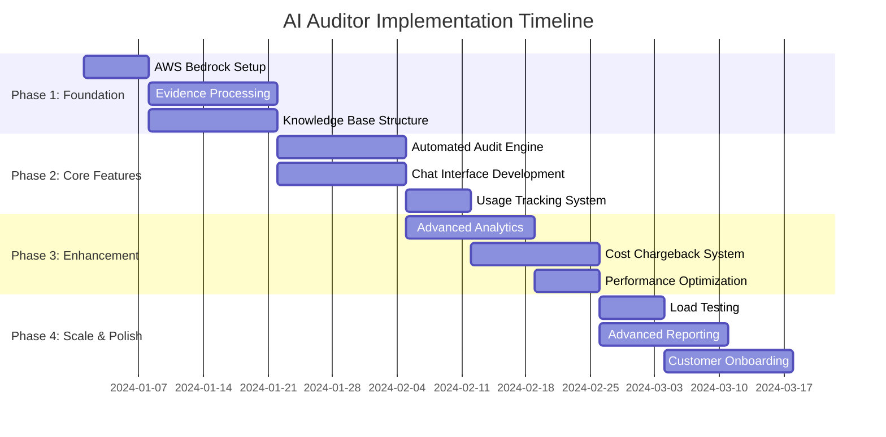

#### Phase Details Flow
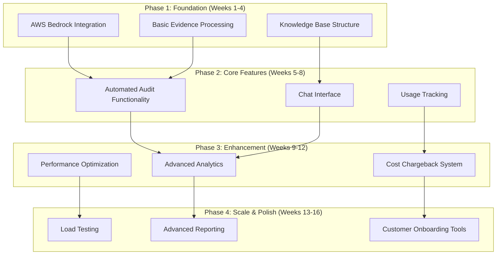

### Risk Mitigation

#### Technical Risks
- **Bubble Performance**: Implement file processing queues
- **AI Accuracy**: Continuous model training and validation
- **Data Security**: Encryption at rest and in transit

#### Business Risks
- **Cost Overruns**: Implement usage caps and alerts
- **Customer Adoption**: Phased rollout with feedback loops
- **Compliance**: Regular security and compliance audits

### Success Metrics

#### KPI Dashboard Overview
```mermaid
graph TD
    subgraph "Technical KPIs"
        ACC[Audit Accuracy >90%]
        RT[Response Time <3s]
        UP[Uptime >99.5%]
        PROC[Processing Speed]
    end
    
    subgraph "Business KPIs"
        ADOPT[Customer Adoption Rate]
        REV[Revenue per Customer]
        COST[Cost Recovery Ratio]
        SAT[Customer Satisfaction]
    end
    
    subgraph "Usage Metrics"
        AU[Audit Runs per Month]
        CM[Chat Messages per User]
        ST[Storage Growth Rate]
        RET[Customer Retention]
    end
    
    ACC --> DASH[KPI Dashboard]
    RT --> DASH
    UP --> DASH
    ADOPT --> DASH
    REV --> DASH
    COST --> DASH
    AU --> DASH
    CM --> DASH
    ST --> DASH
```

#### Success Measurement Flow
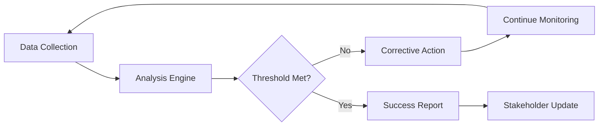

### Next Steps

1. **Stakeholder Review**: Present design to key stakeholders
2. **Technical Validation**: Prototype core AI integration
3. **Cost Modeling**: Detailed financial projections
4. **Customer Research**: Validate pricing with target customers
5. **Development Planning**: Detailed sprint planning and resource allocation

---

*This document serves as the foundation for implementing the AI Auditor feature. Regular updates will be made as requirements evolve and implementation progresses.*