# AI Auditor Design Document
## SaaS Compliance Platform Enhancement

### Executive Summary
This document outlines the design for an AI Auditor feature to be integrated into the existing Bubble-based SaaS compliance platform. The AI Auditor will provide automated evidence review, expert chat assistance, and knowledge base integration using AWS Bedrock.

### Core Capabilities

#### 1. Automated Evidence Auditing
- **Functionality**: AI reviews all uploaded evidence against compliance controls
- **Output**: Detailed feedback and recommendations for each control
- **Trigger**: Customer-initiated audit runs after evidence upload completion

#### 2. Expert Chat Interface
- **Functionality**: Interactive AI assistant for evidence owners
- **Purpose**: Provide auditor expertise and guidance during evidence preparation
- **Context**: Leverages control-specific knowledge base

#### 3. Knowledge Base Integration
- **Scope**: Comprehensive knowledge base for each compliance regime
- **Content**: Control requirements, best practices, common issues
- **Integration**: Powers both audit feedback and chat responses

### Architecture Overview

#### Option 1: Evidence Storage in Bubble (Recommended Approach)

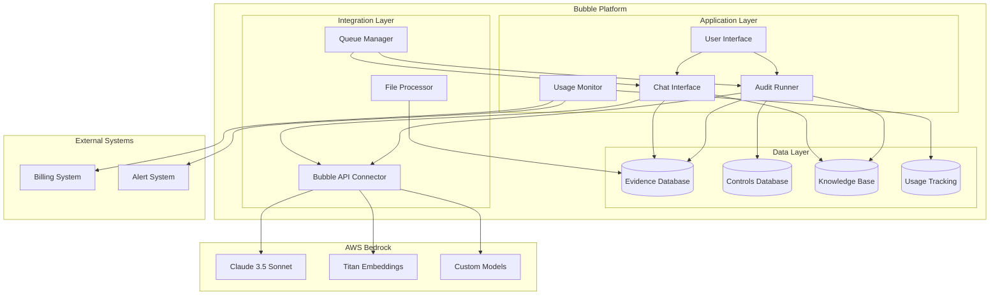

### AI Processing Architecture Decision

#### Option A: Vector Database Approach (Recommended)
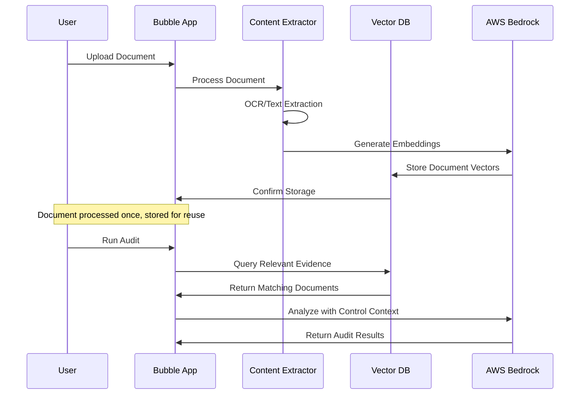

#### Option B: Direct API Approach
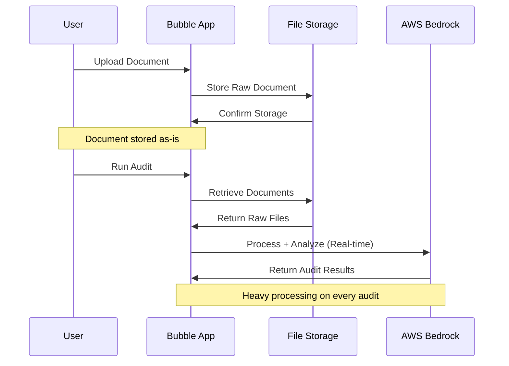

#### Comparison Analysis

| Aspect | Vector DB Approach | Direct API Approach |
|--------|-------------------|-------------------|
| **Initial Processing** | Heavy (once per document) | Light (store only) |
| **Audit Performance** | Fast (pre-processed) | Slow (process each time) |
| **Cost per Audit** | Low (cached embeddings) | High (full reprocessing) |
| **Storage Requirements** | Higher (vectors + raw) | Lower (raw files only) |
| **Scalability** | Excellent | Poor with volume |
| **Multi-language Support** | Better (embedding models) | Depends on multimodal AI |
| **Search Capabilities** | Semantic search enabled | Limited to full document |
| **Complexity** | Higher initial setup | Simpler architecture |

### Technical Implementation

#### Recommended Architecture: Hybrid Vector + Direct Processing

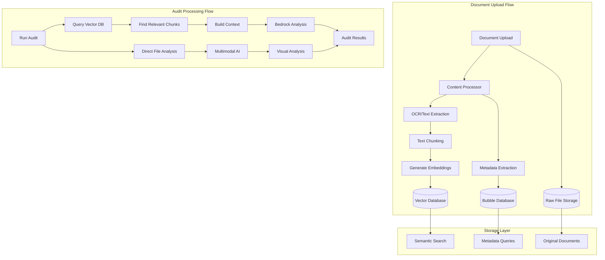

#### Processing Strategy by Document Type

**Text Documents (PDFs, Word, etc.)**
- Extract text → Generate embeddings → Store in vector DB
- Enable semantic search and context retrieval
- Fast audit processing using pre-computed vectors

**Visual Documents (Images, Charts, Diagrams)**
- Store original files → Direct multimodal AI processing
- Use Claude 3.5 Sonnet or GPT-4V for visual analysis
- Process on-demand during audits

**Structured Data (Spreadsheets, JSON)**
- Extract structured data → Store in Bubble database
- Generate embeddings for text fields
- Direct processing for calculations/validations

#### Implementation Details

**Vector Database Options:**
1. **AWS OpenSearch** (Recommended for AWS ecosystem)
2. **Pinecone** (Managed, easy to use)
3. **Chroma** (Open source, self-hosted)
4. **Bubble Plugin** (Vector search plugins available)

**Processing Pipeline:**
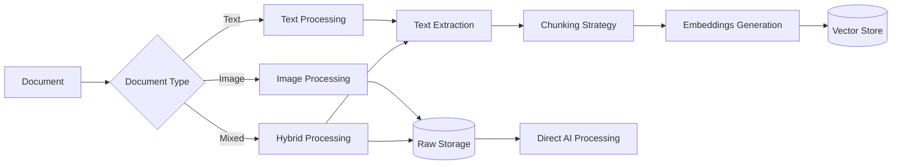

**Chunking Strategy:**
- **Semantic Chunking**: Split by paragraphs, sections
- **Overlap**: 20% overlap between chunks for context
- **Size**: 500-1000 tokens per chunk
- **Metadata**: Include document source, page numbers, control mappings

#### Cost Analysis: Vector DB vs Direct API

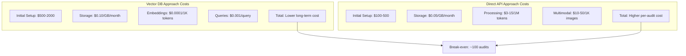

#### Performance Comparison

| Metric | Vector DB | Direct API |
|--------|-----------|------------|
| **Document Upload** | 30-60 seconds | 1-5 seconds |
| **Audit Runtime** | 5-15 seconds | 30-120 seconds |
| **Concurrent Audits** | High (cached data) | Limited (processing bottleneck) |
| **Search Accuracy** | Semantic matching | Full document context |
| **Memory Usage** | Low (vector queries) | High (full document processing) |

#### Recommended Implementation Strategy

**Phase 1: Start with Direct API**
- Faster initial development
- Lower upfront complexity
- Validate user workflows and requirements

**Phase 2: Migrate to Vector DB**
- Implement when you have >50 active customers
- Add vector processing for text documents
- Keep direct processing for images/complex visuals

**Phase 3: Hybrid Optimization**
- Smart routing based on document type
- Caching layer for frequently accessed content
- Advanced semantic search capabilities

#### Code Implementation Approach

**Bubble Workflow for Vector DB:**
```javascript
// Pseudo-code for Bubble backend workflow
When Document is uploaded:
  1. Extract text content
  2. Generate embeddings via Bedrock API
  3. Store vectors in external vector DB
  4. Store metadata in Bubble database
  
When Audit is triggered:
  1. Query vector DB for relevant content
  2. Retrieve top-k similar chunks
  3. Send context + control requirements to Bedrock
  4. Process AI response and store results
```

**Bubble Workflow for Direct API:**
```javascript
// Pseudo-code for direct processing
When Document is uploaded:
  1. Store file in Bubble file storage
  2. Extract basic metadata only
  
When Audit is triggered:
  1. Retrieve all documents for control
  2. Send files directly to Bedrock multimodal
  3. Process response and store results
```

#### Knowledge Base Structure
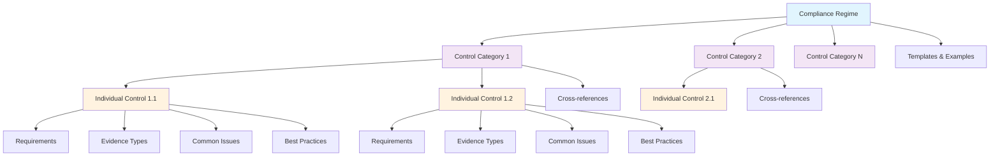

### Pros and Cons Analysis

#### Pros: Evidence in Bubble
✅ **Unified Data Management**: Single source of truth for all compliance data
✅ **Simplified Architecture**: Reduced complexity with fewer external dependencies
✅ **Native Integration**: Seamless workflow within existing Bubble app
✅ **Cost Efficiency**: No additional storage infrastructure costs
✅ **Security**: Leverages Bubble's existing security model
✅ **User Experience**: Consistent interface and permissions model
✅ **Backup/Recovery**: Included in Bubble's data protection
✅ **Compliance**: Easier to maintain data residency requirements

#### Cons: Evidence in Bubble
❌ **Storage Limitations**: Bubble file storage limits may constrain large evidence files
❌ **Performance**: Large file processing may impact app performance
❌ **Scalability**: Potential bottlenecks with high-volume evidence uploads
❌ **File Processing**: Limited native capabilities for complex document analysis
❌ **Vendor Lock-in**: Increased dependency on Bubble platform
❌ **Cost Scaling**: Bubble storage costs may become significant at scale

### Cost Chargeback Options

#### Cost Model Overview
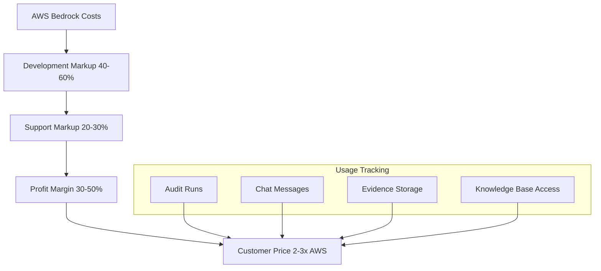

#### 1. Usage-Based Pricing Model
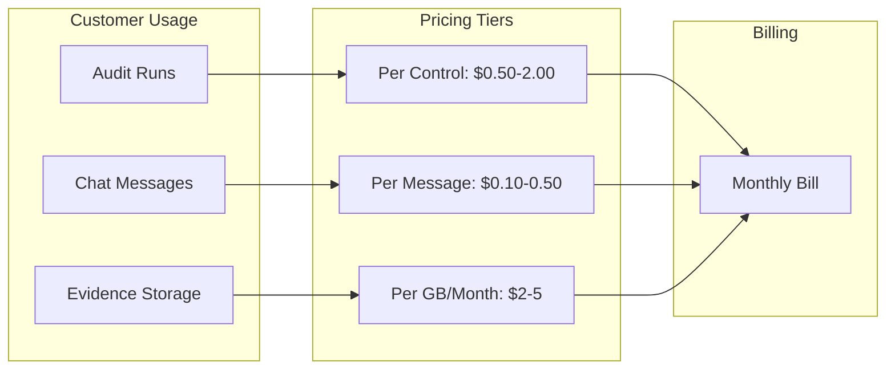

#### 2. Tiered Subscription Model
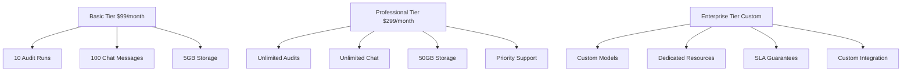

#### 3. Credit-Based System
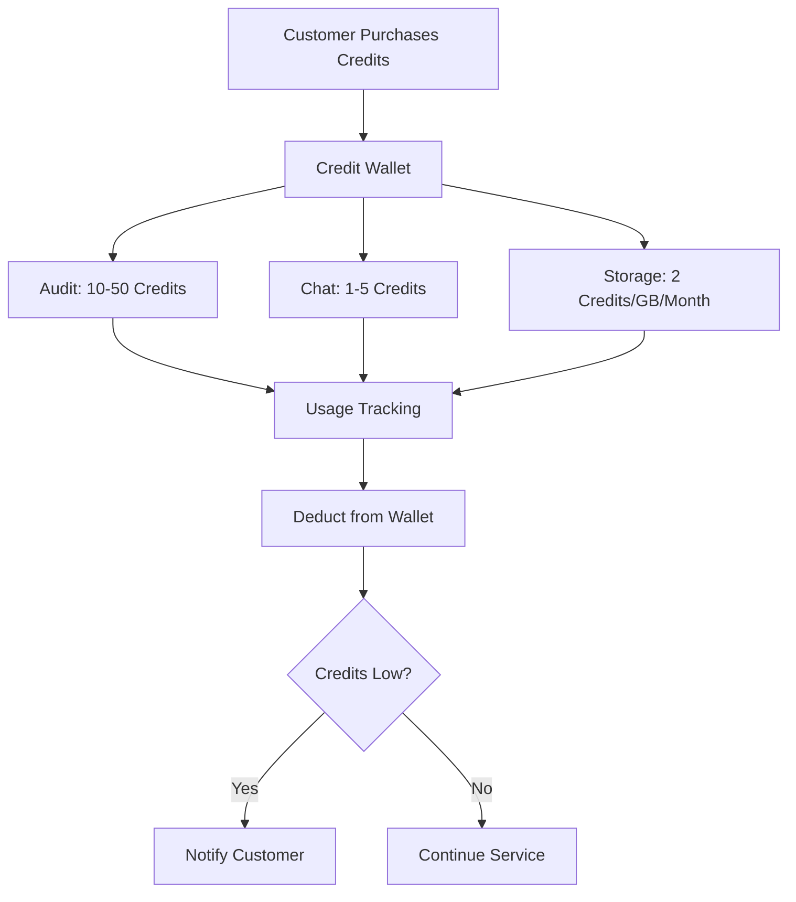

#### 4. Hybrid Model (Recommended)
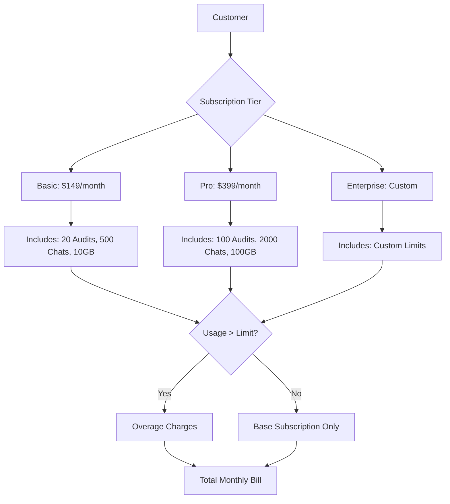

### Cost Calculation Framework

#### AWS Bedrock Costs (Estimated)
- **Claude 3.5 Sonnet**: ~$3 per 1M input tokens, ~$15 per 1M output tokens
- **Titan Embeddings**: ~$0.0001 per 1K tokens
- **Knowledge Base**: ~$0.10 per GB per month

#### Markup Strategy
- **Development/Maintenance**: 40-60% markup
- **Support/Infrastructure**: 20-30% markup
- **Profit Margin**: 30-50% markup
- **Total Customer Price**: 2-3x AWS costs

#### Example Pricing Structure
```
Audit Run Pricing:
- Small Control Set (1-10 controls): $5-15 per run
- Medium Control Set (11-50 controls): $20-50 per run
- Large Control Set (50+ controls): $60-150 per run

Chat Interface:
- Per Message: $0.10-0.50
- Per Session (up to 50 messages): $5-15
- Monthly Unlimited: $50-200

Storage:
- Evidence Storage: $2-5 per GB per month
- Knowledge Base Access: $10-30 per regime per month
```

### Implementation Phases

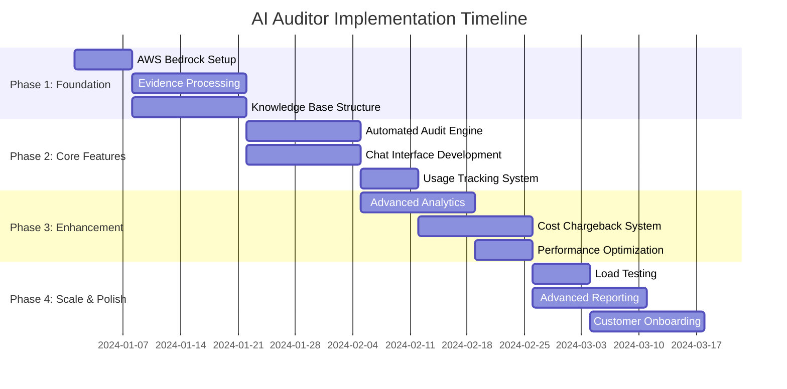

#### Phase Details Flow
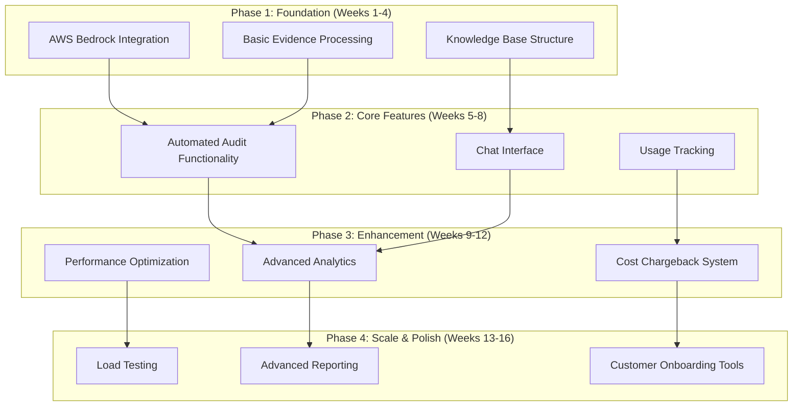

### Risk Mitigation

#### Technical Risks
- **Bubble Performance**: Implement file processing queues
- **AI Accuracy**: Continuous model training and validation
- **Data Security**: Encryption at rest and in transit

#### Business Risks
- **Cost Overruns**: Implement usage caps and alerts
- **Customer Adoption**: Phased rollout with feedback loops
- **Compliance**: Regular security and compliance audits

### Success Metrics

#### KPI Dashboard Overview
```mermaid
graph TD
    subgraph "Technical KPIs"
        ACC[Audit Accuracy >90%]
        RT[Response Time <3s]
        UP[Uptime >99.5%]
        PROC[Processing Speed]
    end
    
    subgraph "Business KPIs"
        ADOPT[Customer Adoption Rate]
        REV[Revenue per Customer]
        COST[Cost Recovery Ratio]
        SAT[Customer Satisfaction]
    end
    
    subgraph "Usage Metrics"
        AU[Audit Runs per Month]
        CM[Chat Messages per User]
        ST[Storage Growth Rate]
        RET[Customer Retention]
    end
    
    ACC --> DASH[KPI Dashboard]
    RT --> DASH
    UP --> DASH
    ADOPT --> DASH
    REV --> DASH
    COST --> DASH
    AU --> DASH
    CM --> DASH
    ST --> DASH
```

#### Success Measurement Flow
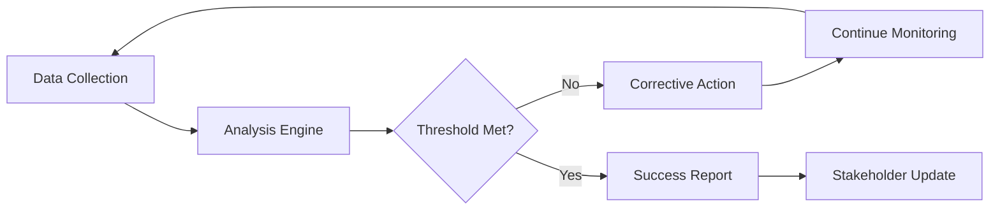

### Next Steps

1. **Stakeholder Review**: Present design to key stakeholders
2. **Technical Validation**: Prototype core AI integration
3. **Cost Modeling**: Detailed financial projections
4. **Customer Research**: Validate pricing with target customers
5. **Development Planning**: Detailed sprint planning and resource allocation

---

*This document serves as the foundation for implementing the AI Auditor feature. Regular updates will be made as requirements evolve and implementation progresses.*

#### Chat Interface Implementation with Vector Context

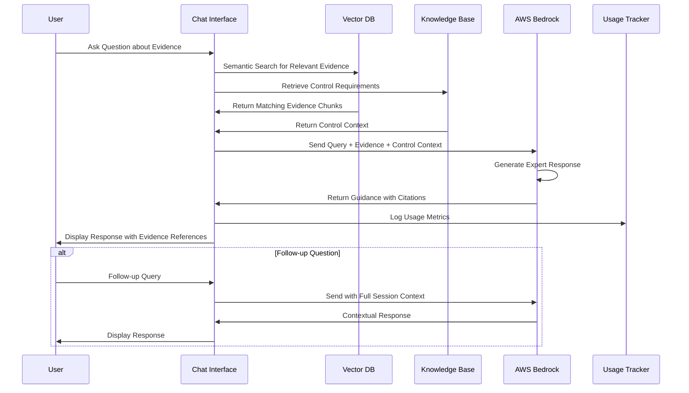

#### Code Implementation Approaches

**Bubble Workflow for Vector DB:**
```javascript
// Pseudo-code for Bubble backend workflow
When Document is uploaded:
  1. Extract text content using OCR/parsing
  2. Generate embeddings via Bedrock Titan
  3. Store vectors in external vector DB (OpenSearch/Pinecone)
  4. Store metadata in Bubble database
  
When Audit is triggered:
  1. Query vector DB for relevant content by control
  2. Retrieve top-k similar chunks (k=5-10)
  3. Build context with control requirements
  4. Send to Bedrock Claude for analysis
  5. Process AI response and store results
```

**Bubble Workflow for Direct API:**
```javascript
// Pseudo-code for direct processing
When Document is uploaded:
  1. Store file in Bubble file storage
  2. Extract basic metadata (filename, size, type)
  
When Audit is triggered:
  1. Retrieve all documents for specific control
  2. Send files directly to Bedrock multimodal API
  3. Include control requirements in prompt
  4. Process response and store results
```

**Hybrid Approach Implementation:**
```javascript
// Smart routing based on document characteristics
When Document is uploaded:
  if (document.type === 'text' || document.type === 'pdf') {
    // Vector DB processing
    processForVectorStorage(document)
  } else if (document.type === 'image' || document.hasVisualElements) {
    // Direct multimodal processing
    storeForDirectProcessing(document)
  } else {
    // Default to vector processing
    processForVectorStorage(document)
  }

When Audit is triggered:
  textEvidence = queryVectorDB(control.requirements)
  visualEvidence = getDirectProcessingFiles(control.id)
  
  results = combineAnalysis(
    analyzeTextEvidence(textEvidence),
    analyzeVisualEvidence(visualEvidence)
  )
```